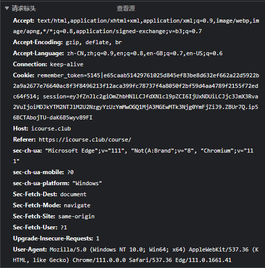
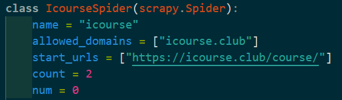
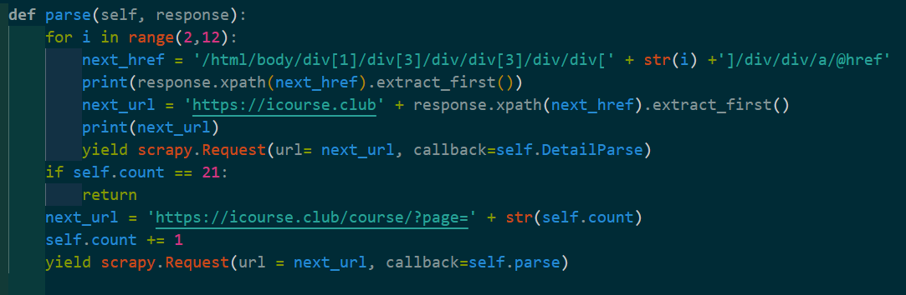
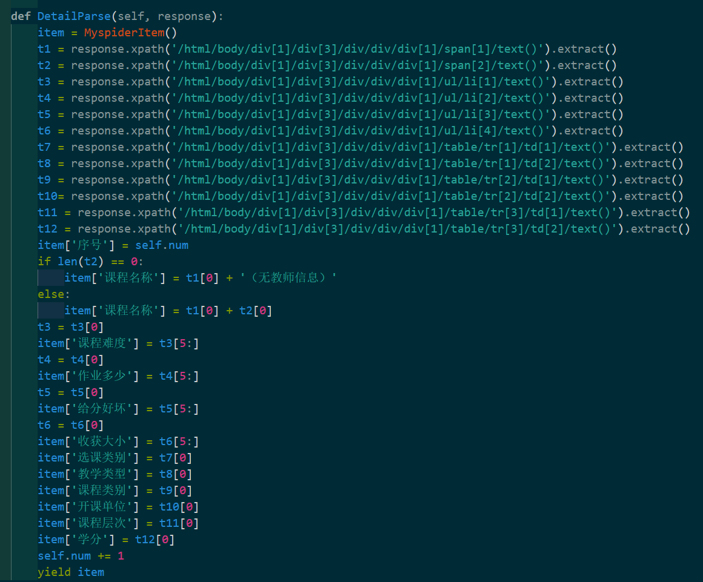
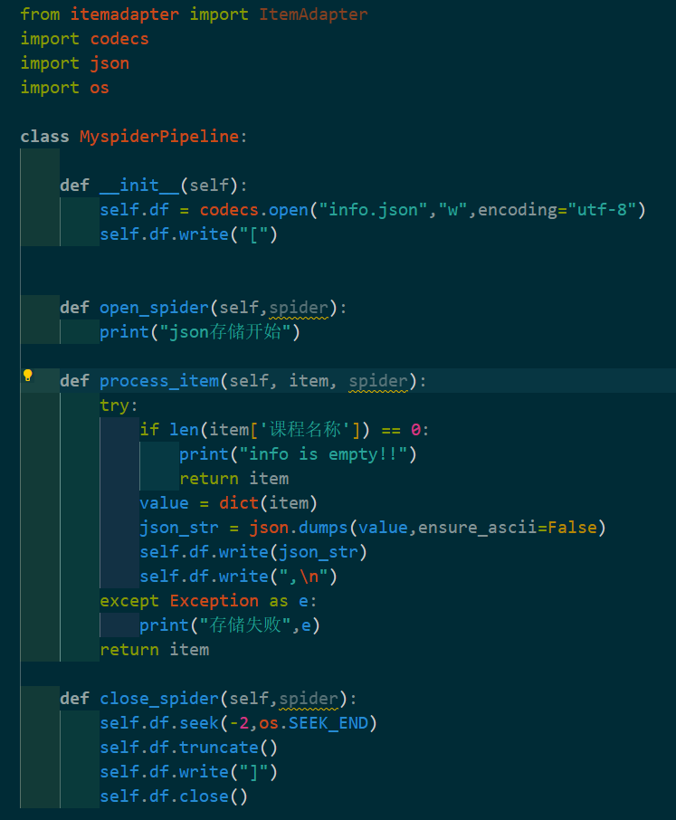
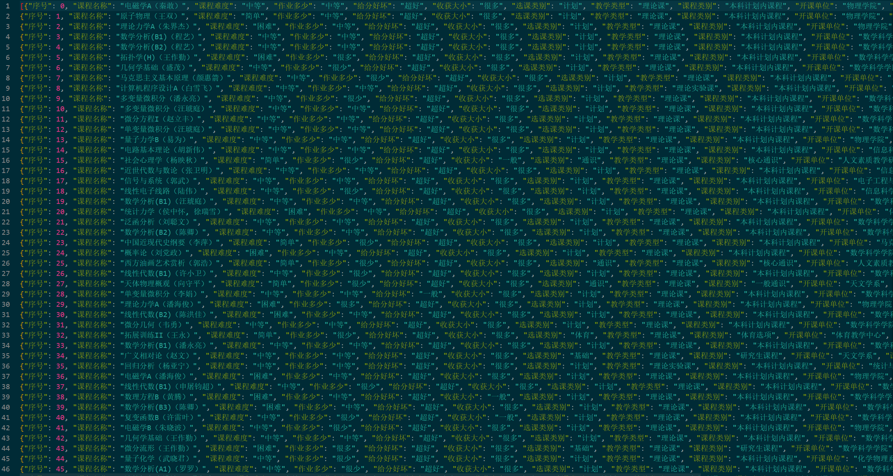

# lab2-数据获取与管理
> 作者：Xiaoma
> 
> 完成时间：2023.3.18
> 
> USTC 评课社区网站 https://icourse.club/course/ 的课程信息爬取

## 实验要求

给定评课社区网站 ，需要设计一个网站遍历策略，爬取至少200个课程的详细信息，包括
- 课程名及授课教师
- 课程难度
- 作业多少
- 给分好坏
- 收获大小
- 选课类别
- 教学类型
- 课程类别
- 开课单位
- 课程层次
- 学分

记录于 json 格式的文件中

## 实验步骤

### scrapy入门

Scrapy 是用 Python 实现的一个为了爬取网站数据、提取结构性数据而编写的应用框架。

Scrapy 常应用在包括数据挖掘，信息处理或存储历史数据等一系列的程序中。

通常我们可以很简单的通过 Scrapy 框架实现一个爬虫，抓取指定网站的内容或图片。

scrapy的架构为

- Scrapy Engine(引擎): 负责Spider、ItemPipeline、Downloader、Scheduler中间的通讯，信号、数据传递等。
- Scheduler(调度器): 它负责接受引擎发送过来的Request请求，并按照一定的方式进行整理排列，入队，当引擎需要时，交还给引擎。
- Downloader（下载器）：负责下载Scrapy Engine(引擎)发送的所有Requests请求，并将其获取到的Responses交还给Scrapy Engine(引擎)，由引擎交给Spider来处理，
- Spider（爬虫）：它负责处理所有Responses,从中分析提取数据，获取Item字段需要的数据，并将需要跟进的URL提交给引擎，再次进入Scheduler(调度器).
- Item Pipeline(管道)：它负责处理Spider中获取到的Item，并进行进行后期处理（详细分析、过滤、存储等）的地方。
- Downloader Middlewares（下载中间件）：你可以当作是一个可以自定义扩展下载功能的组件。
- Spider Middlewares（Spider中间件）：你可以理解为是一个可以自定扩展和操作引擎和Spider中间通信的功能组件（比如进入Spider的Responses;和从Spider出去的Requests）


制作爬虫大致分为4步
1. 创建项目
2. 设定目标
3. 制作爬虫
4. 存储内存

### 制作爬虫步骤
>[xpath教程](https://www.runoob.com/xpath/xpath-tutorial.html)

**安装scrapy库（此处介绍Windows安装）**

首先更新pip版本
```
pip install --upgrade pip
```
通过pip安装scrapy框架
```
pip install Scrapy
```

1. 新建项目
   
   在开始爬取先需要新建一个scrapy项目，在目的目录下运行下列命令
   ```
   scrapy startproject mySpider
   ```
   该目录下将生成如下文件
   ```
    ├─mySpider
        │  scrapy.cfg
        │
        └─mySpider
            │  items.py
            │  middlewares.py
            │  pipelines.py
            │  settings.py
            │  __init__.py
            │
            ├─spiders
            │  │  __init__.py
            │  │
            │  └─__pycache__
            │          __init__.cpython-39.pyc
            │
            └─__pycache__
                    items.cpython-39.pyc
                    middlewares.cpython-39.pyc
                    pipelines.cpython-39.pyc
                    settings.cpython-39.pyc
                    __init__.cpython-39.pyc
    ```
    这些文件分别是：
    - scrapy.cfg: 项目的配置文件
    - mySpider/: 项目的Python模块，将会从这里引用代码
    - mySpider/items.py: 项目的目标文件
    - mySpider/pipelines.py: 项目的管道文件
    - mySpider/settings.py: 项目的设置文件
    - mySpider/spiders/: 存储爬虫代码目录

    为了防止爬虫被直接识别，我们为爬虫设定合适的`DEFAULT_REQUEST_HEADERS`

    

    将`settings.py`文件中的`DEFAULT_REQUEST_HEADERS`更改为图片中的对应内容，该内容的获取方法：F12打开开发工具-网络-点击相应文件

    为了因网络延迟造成的数据丢失，在`settings.py`增加
    ```python
    AUTOTHROTTLE_START_DELAY = 20
    AUTOTHROTTLE_MAX_DELAY = 60
    DOWNLOAD_DELAY = 10
    RANDOMIZE_DOWNLOAD_DELAY = True
    ```

2. 设定目标
   
    根据实验要求，我们需要抓取11项内容，则在item.py中构建一个item模型
    ```python3
    class MyspiderItem(scrapy.Item):
        # define the fields for your item here like:
        # name = scrapy.Field()
        序号 = scrapy.Field()
        课程名称 = scrapy.Field()
        课程难度 = scrapy.Field()
        作业多少 = scrapy.Field()
        给分好坏 = scrapy.Field()
        收获大小 = scrapy.Field()
        选课类别 = scrapy.Field()
        教学类型 = scrapy.Field()
        课程类别 = scrapy.Field()
        开课单位 = scrapy.Field()
        课程层次 = scrapy.Field()
        学分 = scrapy.Field()
    ```

3. 制作爬虫

    在当前目录下执行命令
    ```
    scrapy genspider icourse "https://icourse.club/course/ "
    ```

    该命令将会在`mySpider/spider`目录下生成`icourse.py`，我们对其中的parse函数进行编辑，以保证其能正确爬取数据。

    **查看`class IcourseSpider(scrapy.Spiser)`的初始化部分**

    
    - `name`即爬虫的名称
    - `allowed_domains`为爬虫可以访问的域的范围
    - `start_urls`为爬虫开始访问的域名
    - `count`作为本次实验的页计数
    - `num`为数据序号

    **查看函数`parse(self, response)`**

    
    - 已知开始访问的域名只有课程列表，若需访问每个课程的数据，需要进行页面跳转，故需要计算跳转目的页面的地址，通过页面的源代码得到目的页面部分地址的Xpath路径，进行拼接后得到跳转的地址，使用`yield scrapy.Request(url= next_url, callback=self.DetailParse)`将请求数据作为参数传入`DetailParse(self, response)`并执行
    - 当页面数达到20（爬取数据量达到200）时，直接返回
    - 否则继续执行`parse(self, response)`

    **查看函数`DetailParse(self, response)`**

    
    - 此函数的主要目的为提取目标页面中所需要的数据
    - 根据页面源代码得到目标数据的Xpath路径
    - 根据个别数据的特殊性判断其是否为空并做相应处理
    - 使用`yield item`将数据传入`pipelines.py`

    **获得页面元素Xpath路径的注意事项**

    我们通常可以在浏览器中使用开发者工具查看页面源代码，检查选定元素，复制其Xpath路径，通常是一种便捷的方法。

    但有时，浏览器内核会对源代码进行自动优化，即在浏览器中查看的代码通常与真实源代码不相同，这就会导致爬虫无法根据该Xpath路径得到数据。故推荐直接根据HTML文件来获得相应的Xpath路径。

4. 存储内存

    已知每次获得的数据将会传入`pipelines.py`中处理，根据实验要求，我们将数据记录于json格式的文件中。

    

## 实验结果

实验爬取的部分数据如下所示



## 实验反思

在使用爬虫的过程中，若使用不当，IP会被某些网址永久封禁，故需要设定合理的`DEFAULT_REQUEST_HEADERS`。

考虑网络延迟问题，采用随机时间间隔的方法连续爬取数据，保证不会出现数据丢失的情况。

部分教师信息信息为空，填充为“（无教师信息）”